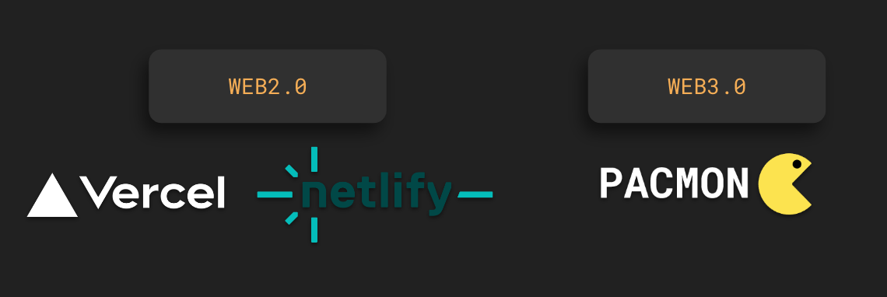

# PACMON

---

Making E2E testing and deployment more convenience and _**save engineer’s assistance effort**_

## Repositories

[PACMON Interface](https://github.com/PacmonTeam/pac-interface) 
[PACMON Backend](https://github.com/PacmonTeam/pac-backend) 
[PACMON Plugins](https://github.com/PacmonTeam/pac-plugins) _- Open for contribution_ 

## Links

https://pacmon.suijin.xyz/

[Full DEMO Video - v2](https://drive.google.com/file/d/1JOMLpircSHlKsx2vYlgN2zIYOQrp8E1K/view?usp=sharing)

[Viction Startup Hackathon Pitch](https://docs.google.com/presentation/d/1OAkjmmyA3BZneuB8fFIR4mNX_hVTdN7YXvv11OUSF3s/edit?usp=sharing)

## Links Achieved

[Full DEMO Video - v1](https://drive.google.com/file/d/19RvXpWWV8m6ofa_PArl2ALnWmW5K2Axj/view?usp=sharing)

[BKKBUIDL2023 Pitch PDF](https://github.com/PacmonTeam/pacmon/blob/master/PACMON-Pitch-bkkbuidl2023.pdf)

## Release Logs

### POC - 26 Dec 2023

- Support Automated e2e testing on local, github action, or any CI/CD
- Pacmon SDK (TypeScript) for Integration with Playwright or Cypress

### POC - 4 Nov 2023

#### Limitations

- No separation of projects/nodes for each users
- Support manual e2e testing only
- Deleting node doesn’t truly destroy the Ethereum node, though it will disappear from nodes list
- Template configurations are limited inside the scope of examples we provided
- _Only supports solidity v0.8.19_
